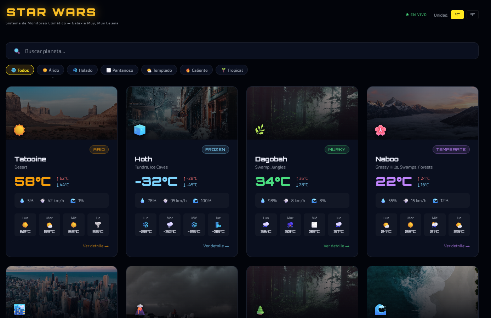
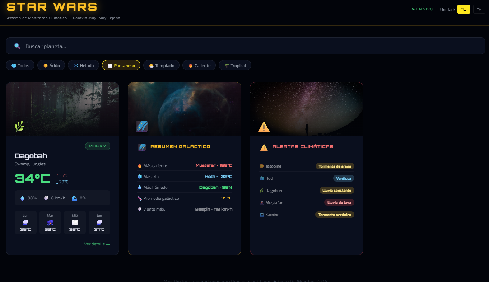
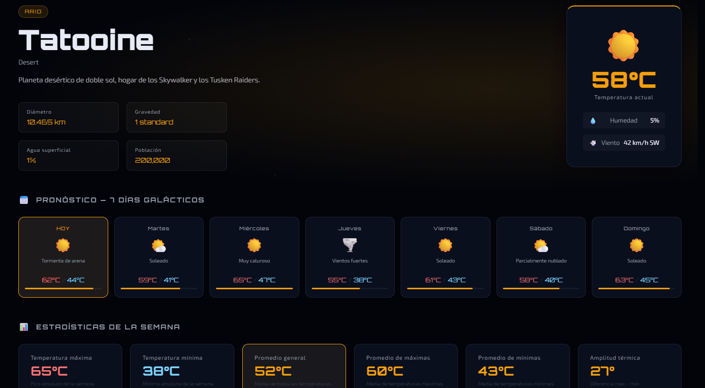

# 🌌 Star Wars Galactic Weather


Aplicación **SPA** desarrollada con **Vue 3** y **Vite**, inspirada en el universo de **Star Wars**, que permite explorar el clima de distintos planetas mediante una interfaz moderna e interactiva.

El proyecto fue desarrollado para fortalecer habilidades en **Vue Router**, **componentes reutilizables**, **props**, **estado reactivo**, **filtrado dinámico** y **navegación entre vistas**, aplicando un diseño visual inspirado en la saga.

---

# 📑 Índice

- [🚀 Demo](#-demo)
- [✨ Características](#-características)
- [🛠️ Tecnologías utilizadas](#️-tecnologías-utilizadas)
- [📂 Estructura del proyecto](#-estructura-del-proyecto)
- [📸 Capturas](#-capturas)
- [⚙️ Instalación](#️-instalación)
- [💡 Funcionalidades destacadas](#-funcionalidades-destacadas)
- [🔮 Mejoras futuras](#-mejoras-futuras)
- [👩‍💻 Autor](#-autor)
- [📄 Licencia](#-licencia)

---

# 🚀 Demo

🌐 **Aplicación en línea:**  
https://star-wars-galactic-weather.vercel.app/#/

💻 **Repositorio GitHub:**  
https://github.com/Paula-front/star-wars-galactic-weather

---

# ✨ Características

- 🌍 Exploración de planetas inspirados en Star Wars.
- 🔍 Búsqueda dinámica por nombre.
- 🌡️ Conversión entre grados Celsius y Fahrenheit.
- 🛰️ Filtros por tipo de clima.
- 📊 Resumen climático galáctico.
- ⚠️ Panel de alertas climáticas.
- 📅 Pronóstico de varios días.
- 🪐 Vista detallada de cada planeta.
- ⚡ Navegación mediante Vue Router.
- 📱 Diseño responsive.

---

# 🛠️ Tecnologías utilizadas

- Vue 3
- Vue Router
- Vite
- JavaScript (ES6+)
- HTML5
- CSS3

---

# 📂 Estructura del proyecto

```text
star-wars-galactic-weather/
│
├── docs/
│   └── screenshots/
│       ├── home.png
│       ├── filters.png
│       └── detail.png
│
├── src/
│   ├── components/
│   ├── data/
│   ├── router/
│   ├── styles/
│   ├── views/
│   ├── App.vue
│   └── main.js
│
├── index.html
├── package.json
├── vite.config.js
└── README.md
```

---

# 📸 Capturas

## 🏠 Página principal



---

## 🔍 Búsqueda y filtros



---

## 🪐 Detalle del planeta



---

# ⚙️ Instalación

### Clonar el repositorio

```bash
git clone https://github.com/Paula-front/star-wars-galactic-weather.git
```

### Ingresar al proyecto

```bash
cd star-wars-galactic-weather
```

### Instalar dependencias

```bash
npm install
```

### Ejecutar en modo desarrollo

```bash
npm run dev
```

### Compilar para producción

```bash
npm run build
```

### Previsualizar el proyecto compilado

```bash
npm run preview
```

---

# 💡 Funcionalidades destacadas

- Navegación SPA mediante Vue Router.
- Componentes reutilizables.
- Filtrado dinámico por tipo de clima.
- Búsqueda reactiva en tiempo real.
- Conversión de unidades de temperatura.
- Vista detallada para cada planeta.
- Pronóstico extendido.
- Panel de resumen climático.
- Alertas meteorológicas.
- Diseño inspirado en la interfaz de Star Wars.
- Organización modular del código.

---

# 🔮 Mejoras futuras

- Consumo de una API meteorológica real.
- Sistema de favoritos.
- Persistencia mediante Local Storage.
- Animaciones y transiciones.
- Modo claro / oscuro.
- Internacionalización (i18n).
- Más planetas y categorías climáticas.

---

# 👩‍💻 Autor

**Paula Pérez Valenzuela**

Proyecto desarrollado como parte del **Bootcamp Desarrollo de Aplicaciones Front-End Trainee**, aplicando Vue 3, Vue Router y Vite para el desarrollo de aplicaciones SPA modernas.

---

# 📄 Licencia

Este proyecto fue desarrollado con fines educativos y de aprendizaje.